# Expert Review Flow

The expert review pipeline automatically evaluates every AI-generated plan through a panel of 11 domain-specific AI experts before it reaches the approval stage. This document describes the full lifecycle using Mermaid diagrams.

---

## Suggestion Status Lifecycle

The expert review phase sits between the initial AI discussion and the plan-approval gate.

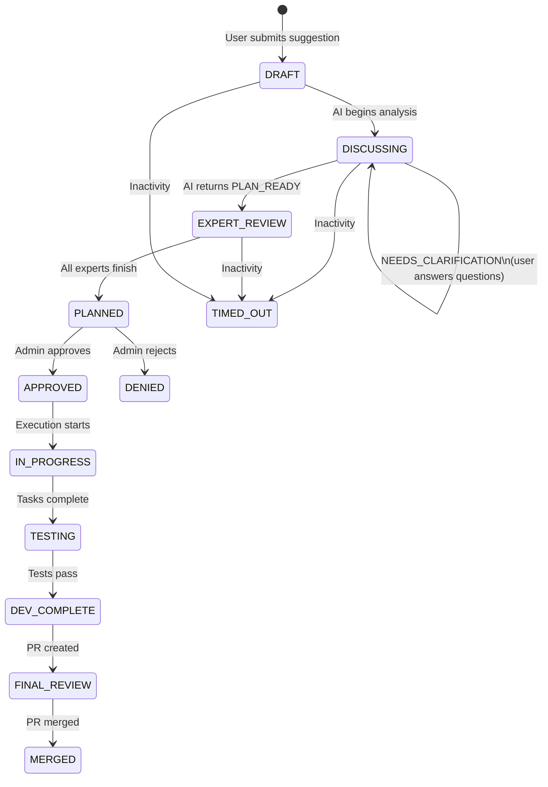

---

## Expert Panel & Batch Structure

Experts are organized into four sequential batches. Experts within the same batch run **concurrently**; batches run **sequentially** so later experts can see earlier notes.

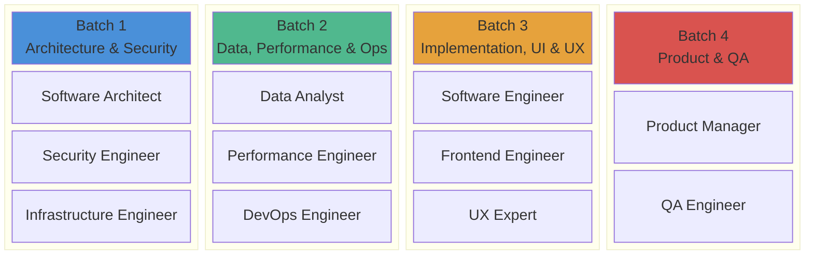

---

## Expert Domain Mapping

Each expert belongs to a domain. When an expert proposes changes that get accepted, the domain is tracked so that affected domains can be targeted for re-review.

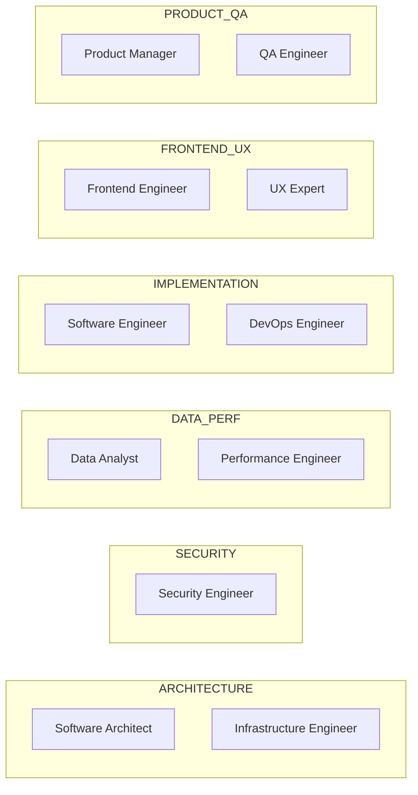

### Affected Domains (Ripple Rules)

When a domain's expert proposes accepted changes, these related domains must also re-review:

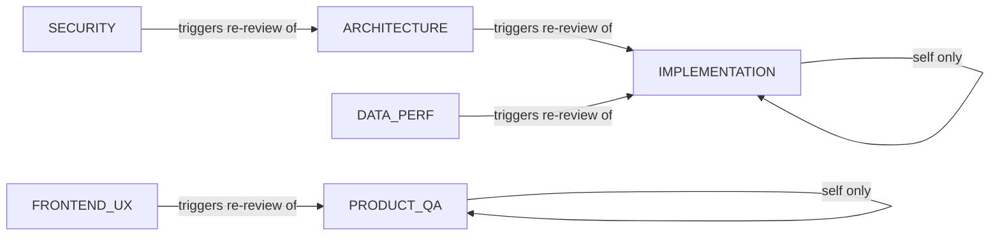

---

## Main Expert Review Pipeline

This is the top-level flow from entry to exit.

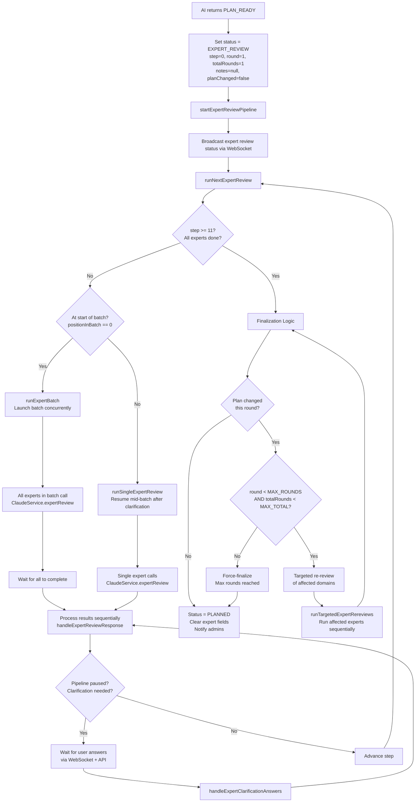

---

## Individual Expert Response Handling

Each expert's response from Claude is parsed and handled according to its `status` field.

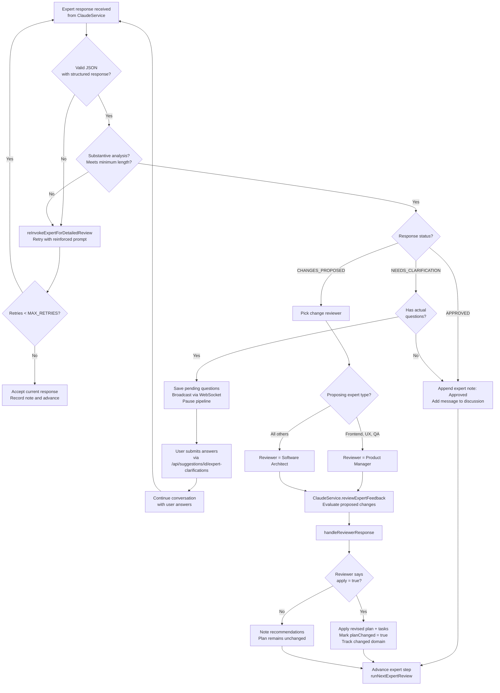

---

## Batch Execution Detail

Within a batch, experts run in parallel. Results are processed sequentially after all complete.

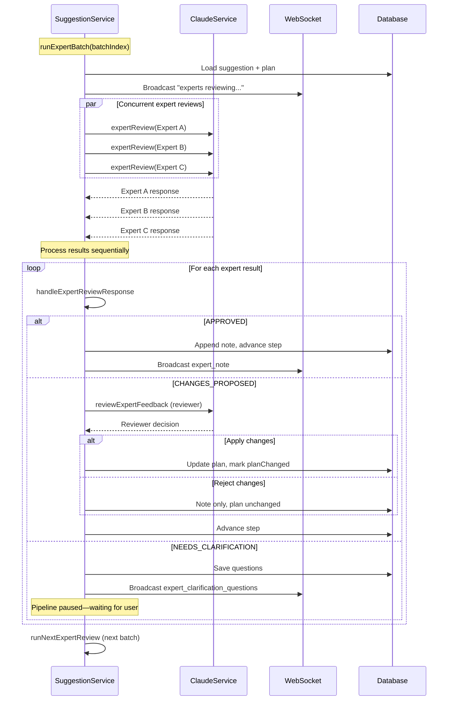

---

## Round & Re-Review Logic

When experts propose changes that get accepted, the plan is modified. After all experts finish, affected domain experts re-review.

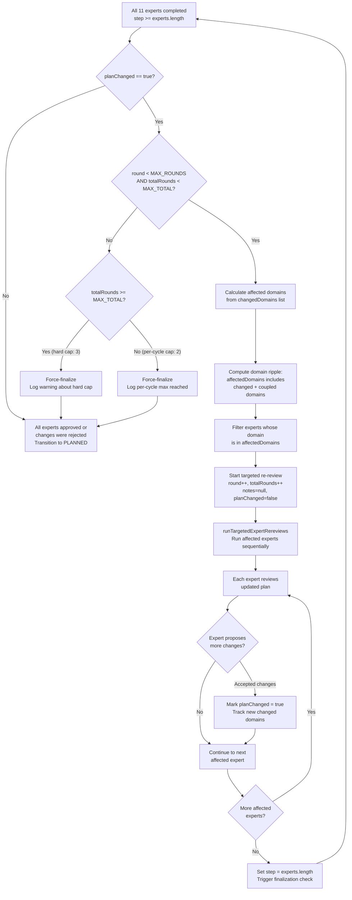

### Round Limits

| Constant | Value | Purpose |
|---|---|---|
| `MAX_EXPERT_REVIEW_ROUNDS` | 2 | Maximum rounds within a single review cycle |
| `MAX_TOTAL_EXPERT_REVIEW_ROUNDS` | 3 | Hard cap across all cycles (including user-guided restarts) |

---

## User Clarification During Expert Review

When an expert needs more information from the user, the pipeline pauses and waits.

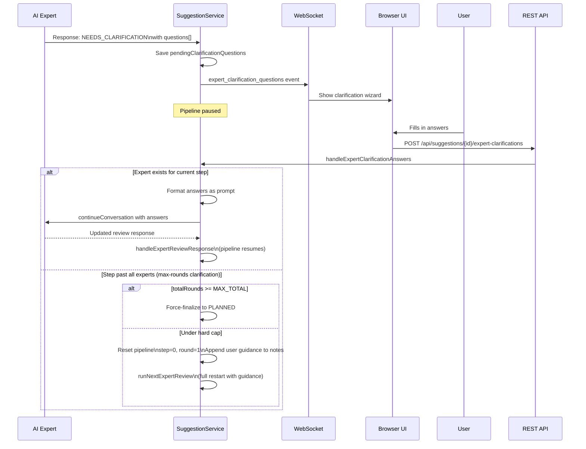

---

## WebSocket Events

Real-time updates are pushed to connected browsers throughout the review process.

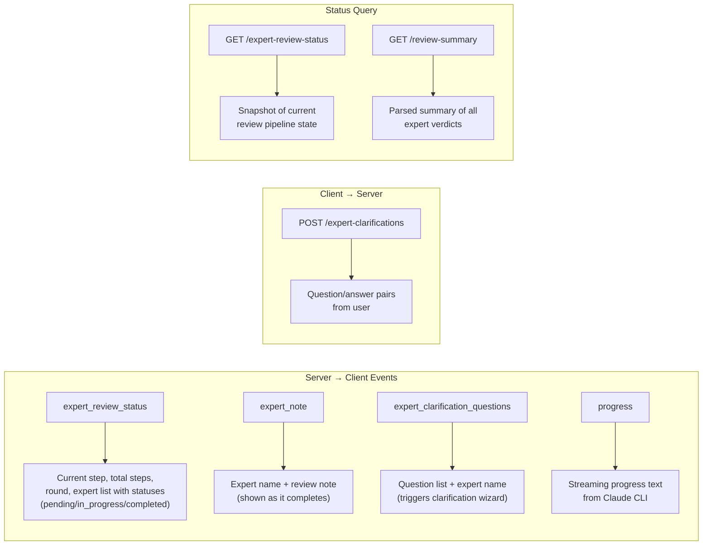

---

## Change Review Gate

When an expert proposes changes (`CHANGES_PROPOSED`), a second expert acts as reviewer to decide whether the changes should be applied.

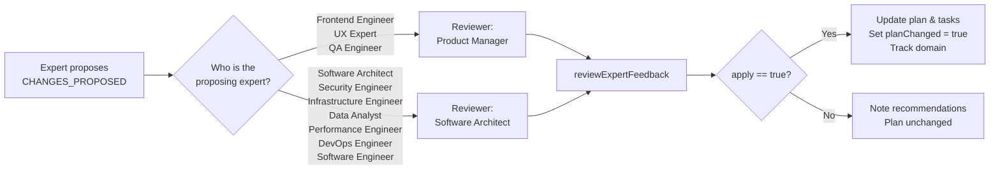

### Round-Aware Reviewer Behavior

In re-review rounds (`round > 1`), the reviewer's acceptance bar is raised: only changes fixing **critical regressions** introduced by recent plan updates are approved. All other changes are rejected to ensure convergence.
