# Expert Review Flow

The expert review pipeline automatically evaluates every AI-generated plan through a panel of 11 domain-specific AI experts before it reaches the approval stage. This document describes the full lifecycle using Mermaid diagrams.

---

## Suggestion Status Lifecycle

The expert review phase sits between the initial AI discussion and the plan-approval gate.

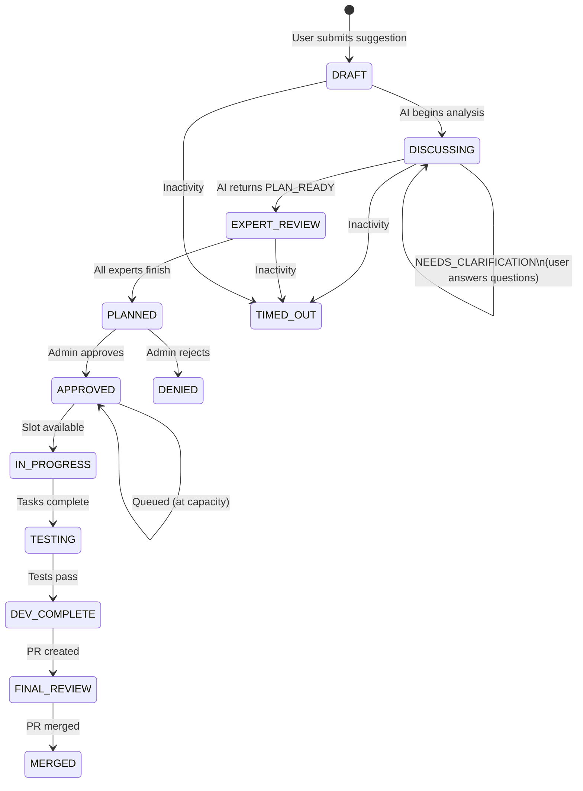

---

## Expert Panel & Execution Order

Experts run **sequentially, one at a time**, so every expert can see the notes from all prior reviews.

```mermaid
flowchart LR
    SA[1. Software\nArchitect] --> SE[2. Security\nEngineer]
    SE --> IE[3. Infrastructure\nEngineer]
    IE --> DA[4. Data\nAnalyst]
    DA --> PE[5. Performance\nEngineer]
    PE --> DE[6. DevOps\nEngineer]
    DE --> SWE[7. Software\nEngineer]
    SWE --> FE[8. Frontend\nEngineer]
    FE --> UX[9. UX\nExpert]
    UX --> PM[10. Product\nManager]
    PM --> QA[11. QA\nEngineer]

    style SA fill:#4a90d9,color:#fff
    style SE fill:#4a90d9,color:#fff
    style IE fill:#4a90d9,color:#fff
    style DA fill:#50b88e,color:#fff
    style PE fill:#50b88e,color:#fff
    style DE fill:#50b88e,color:#fff
    style SWE fill:#e6a23c,color:#fff
    style FE fill:#e6a23c,color:#fff
    style UX fill:#e6a23c,color:#fff
    style PM fill:#d9534f,color:#fff
    style QA fill:#d9534f,color:#fff
```

---

## Expert Domain Mapping

Each expert belongs to a domain. When an expert proposes changes that get accepted, the domain is tracked so that affected domains can be targeted for re-review.

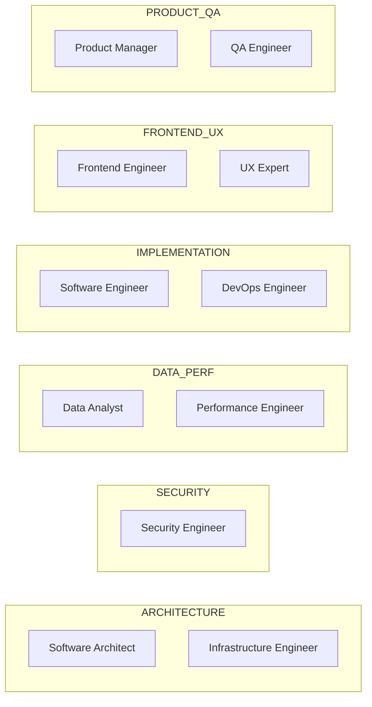

### Affected Domains (Ripple Rules)

When a domain's expert proposes accepted changes, these related domains must also re-review:

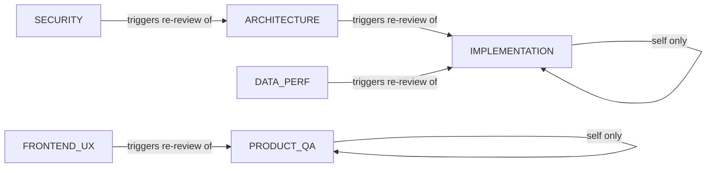

---

## Main Expert Review Pipeline

This is the top-level flow from entry to exit.

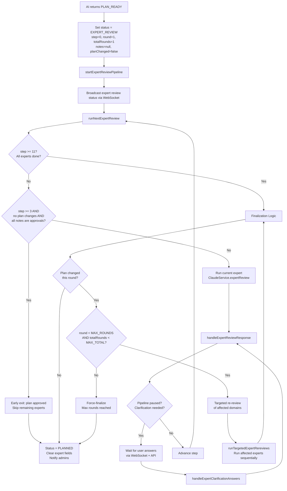

---

## Individual Expert Response Handling

Each expert's response from Claude is parsed and handled according to its `status` field.

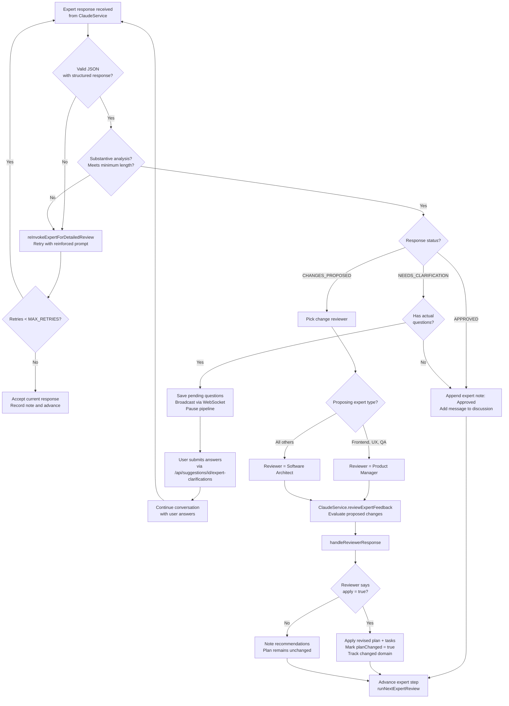

---

## Sequential Expert Execution Detail

Each expert runs one at a time. After an expert completes, its response is processed before moving to the next.

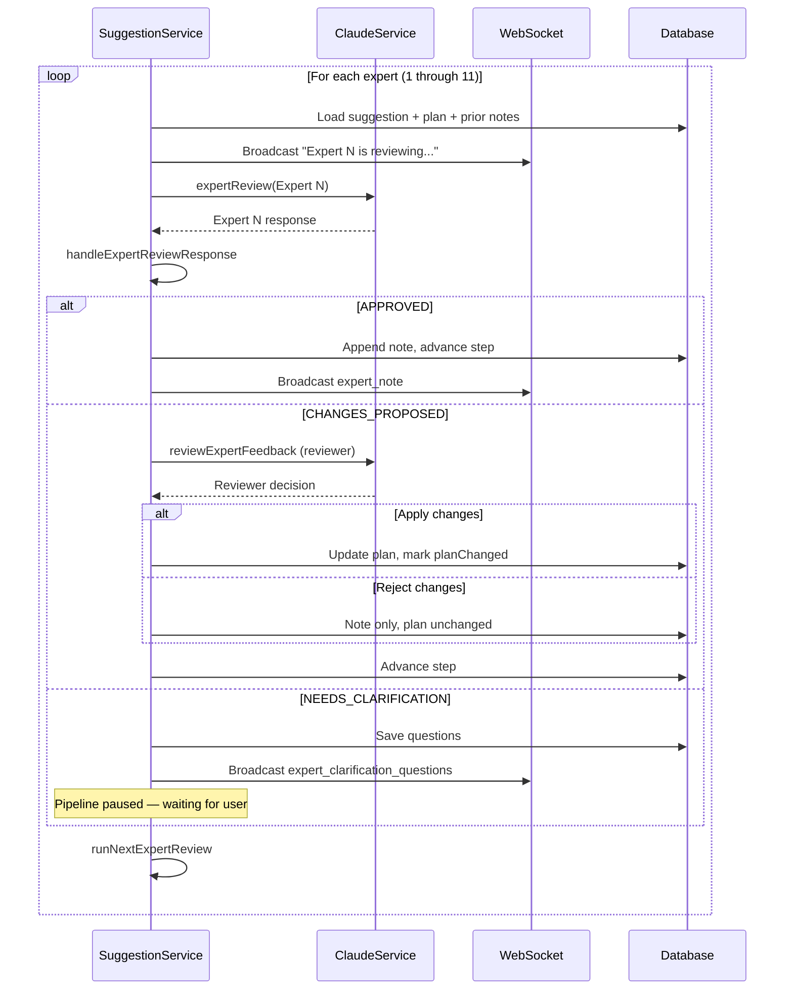

---

## Round & Re-Review Logic

When experts propose changes that get accepted, the plan is modified. After all experts finish, affected domain experts re-review.

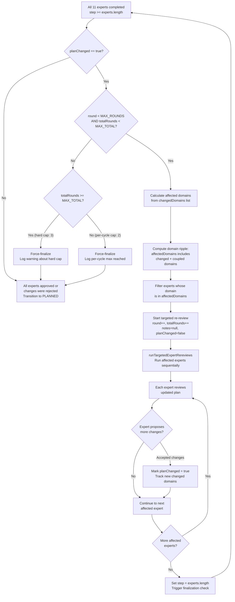

### Constants

| Constant | Value | Purpose |
|---|---|---|
| `MIN_APPROVALS_FOR_EARLY_EXIT` | 3 | Minimum consecutive approvals (with no plan changes) before skipping remaining experts |
| `MAX_EXPERT_REVIEW_ROUNDS` | 2 | Maximum rounds within a single review cycle |
| `MAX_TOTAL_EXPERT_REVIEW_ROUNDS` | 3 | Hard cap across all cycles (including user-guided restarts) |

---

## User Clarification During Expert Review

When an expert needs more information from the user, the pipeline pauses and waits.

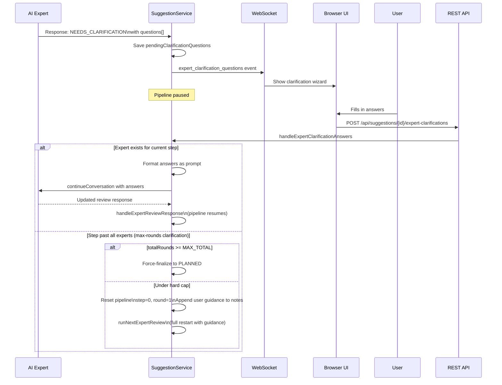

---

## WebSocket Events

Real-time updates are pushed to connected browsers throughout the review process.

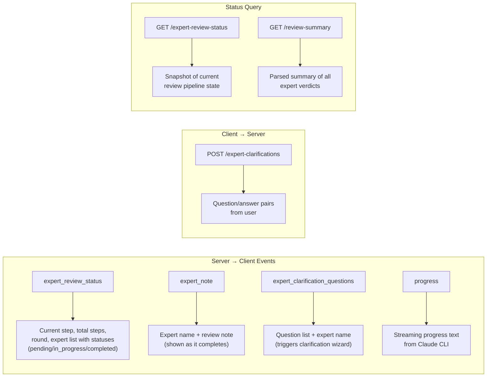

---

## Change Review Gate

When an expert proposes changes (`CHANGES_PROPOSED`), a second expert acts as reviewer to decide whether the changes should be applied.

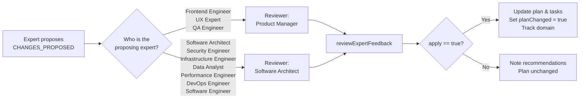

### Round-Aware Reviewer Behavior

In re-review rounds (`round > 1`), the reviewer's acceptance bar is raised: only changes fixing **critical regressions** introduced by recent plan updates are approved. All other changes are rejected to ensure convergence.

---

## Suggestion Execution Concurrency

After admin approval, suggestion execution is gated by a configurable concurrency limit (`maxConcurrentSuggestions`, default **1**). This ensures only N suggestions run tasks at a time.

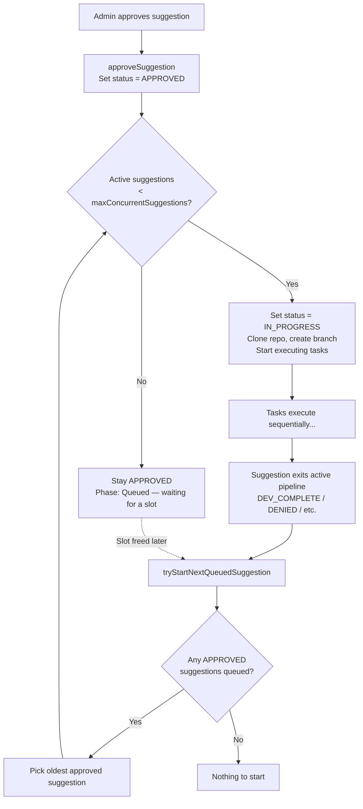

### How it works

- **Active suggestions** are counted as those with status `IN_PROGRESS` or `TESTING`
- When a suggestion is approved, the system checks if the active count is below the limit
- If at capacity, the suggestion stays `APPROVED` with a "queued" message and phase
- When any suggestion exits the active pipeline (dev complete, denied, failed), `tryStartNextQueuedSuggestion()` picks the oldest queued `APPROVED` suggestion and starts it
- On startup, `IN_PROGRESS`/`TESTING` suggestions resume first, then `APPROVED` suggestions are started respecting the limit

### Configuration

The limit is configurable in the **Settings** page under **Max Concurrent Suggestions** (default: 1). It is stored in `site_settings.max_concurrent_suggestions`.
